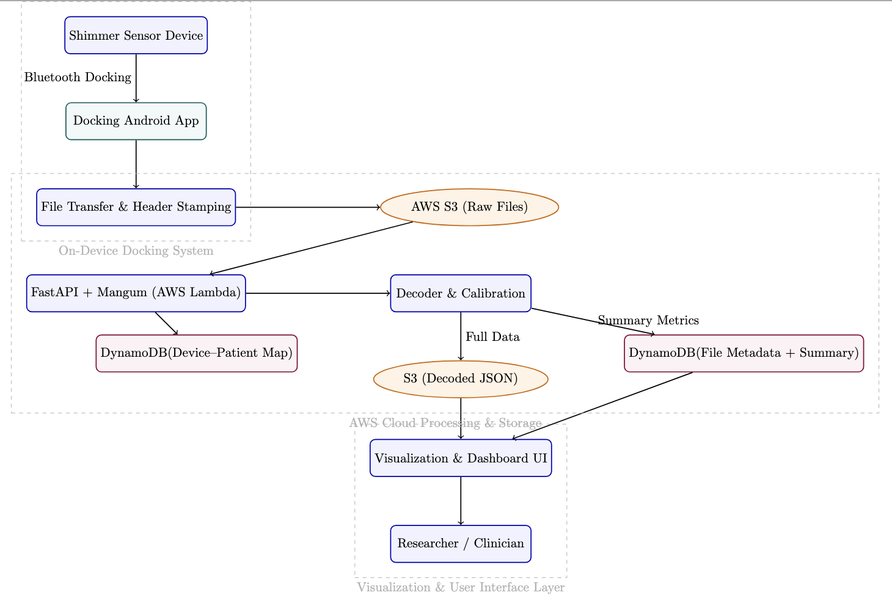

# Configurable Open Source System for Data Acquisition (COSDA) 

**An end-to-end, serverless data acquisition and processing ecosystem for Shimmer wireless sensors**

---

## 🧭 Overview

The **UMass Shimmer Project** is a modular platform built by the University of Massachusetts research community to automate **data extraction, decoding, and synchronization** of Shimmer sensor data.

In the current landscape, many organizations rely on proprietary or third-party platforms to sync and manage sensor data. This project serves as an open-source example for building a fully self-reliant, end-to-end system—empowering researchers and developers to create, control, and extend their own data acquisition and processing pipelines without vendor lock-in.

It integrates three coordinated subsystems — **Android Docking**, **Serverless Cloud Backend**, and a **Web Visualization Interface** — designed for scalability, automation, and fault tolerance.

---

## 🏗️ System Architecture

The architecture connects a local-first Android docking app with a fully serverless AWS backend.
A separate web portal enables researchers to visualize, filter, and download decoded sensor data.

  

---

### **1️⃣ Android Docking Subsystem**

📦 **Repository:** [cosda-umass/shimmer-docking-android](https://github.com/cosda-umass/shimmer-docking-android)

The **ShimmerDock Android app** automates nightly extraction and synchronization of data from Shimmer sensors using Bluetooth RFCOMM.

#### Workflow

1. **Device Discovery** – Scans and verifies docking state via Bluetooth.
2. **File Transfer** – Transfers data using a reliable chunk-based ACK/NACK protocol.
3. **Local Caching** – Stores files in private app storage and logs sync status via SQLite.
4. **Cloud Sync** – Uploads to S3 via pre-signed URLs (>5 MB files handled efficiently).

#### Design Highlights

* Built in **Java** for precise control over RFCOMM and background tasks.
* Operates as a **state machine**, with scanning, transfer, and sync as independent states.
* Nightly automation powered by **Android AlarmManager**.
* **Firebase Crashlytics** integrated for operational logging and error monitoring.
* **Local-first architecture** ensures no data loss in offline environments.

### **2️⃣ Cloud Processing and API Layer**

📦 **Repository:** [cosda-umass/shimmer-cloud-api](https://github.com/cosda-umass/shimmer-data-sync-api)

The backend is implemented using **Python (FastAPI)** and deployed serverlessly via **AWS Lambda** and **API Gateway**. It ingests, decodes, and manages uploaded Shimmer binary files from the Android subsystem.

#### Architecture Overview

* Files uploaded from the mobile app are stored in **Amazon S3**.
* A **pre-signed URL** strategy allows uploads > 6 MB directly to S3, avoiding HTTP timeouts.
* The **FastAPI + Mangum** stack exposes REST endpoints for file registration and retrieval.
* **Serverless execution** ensures zero idle cost and automatic horizontal scaling.

#### AWS Components

| Service              | Role                                                                   |
| -------------------- | ---------------------------------------------------------------------- |
| **S3**               | Stores raw binary and decoded JSON data (under `/decode/`).            |
| **DynamoDB**         | Maintains metadata: file names, timestamps, device IDs, user mappings. |
| **Lambda (FastAPI)** | Handles file registration, decode triggers, and retrieval requests.    |
| **CloudWatch**       | Centralized logging and performance monitoring.                        |
| **IAM**              | Enforces least-privilege access across AWS resources.                  |

#### Performance Optimizations

* **Serverless architecture** reduces operational complexity and cost.
* **Hybrid storage (S3 + DynamoDB)** separates large raw data from metadata, improving query latency by **≈ 80 %** (from 10–12 s → 2–3 s).
* **Lambda memory increased from 512 MB → 1769 MB**, improving decoding speed by **≈ 75 %**
  *(52 s → 13 s for a 1.4 MB file).*
* Fully modular cloud design enables the **mobile and cloud layers to evolve independently** while preserving a single data model.

---

### **3️⃣ Visualization and Web Interface**

📦 **Repository:** [cosda-umass/shimmer-web-ui](https://github.com/cosda-umass/shimmer-web-ui)

A lightweight Angular-based interface provides tools for data visualization and management.

#### Features

* Query metadata and filter files by user, device, or session.
* Fetch and download decoded JSON files directly from S3.
* Supports **downsampling** for large datasets (6 k+ points) for improved chart readability.
* Built with **Angular** for modular, component-based development.
* Authentication and authorization powered by **AWS Amplify User Pools**.

#### Planned Extensions

* Analytical dashboards for multi-sensor studies.
* Integration with external research tools and ML pipelines.

---

## ⚙️ Technology Summary

| Layer          | Technology                            | Purpose                                  |
| -------------- | ------------------------------------- | ---------------------------------------- |
| **Hardware**   | Shimmer 3 Wireless Sensors            | Physiological and kinematic data capture |
| **Mobile App** | Android (Java)                        | Docking, transfer, and sync automation   |
| **Backend**    | AWS Lambda + FastAPI (Python)         | Serverless decoding and APIs             |
| **Storage**    | Amazon S3 + DynamoDB                  | Hybrid data + metadata storage           |
| **Web UI**     | Angular + Amplify Auth                | Visualization and management             |
| **Monitoring** | AWS CloudWatch + Firebase Crashlytics | Centralized logs and diagnostics         |

---

## 📚 Documentation & References

| Section             | Description                           | Link                                                                       |
| ------------------- | ------------------------------------- | -------------------------------------------------------------------------- |
| **Getting Started** | Setup and installation guides         | [View Guide](https://cosda-umass.github.io/cosda-umass/getting-started/) |
| **Architecture**    | System design and AWS components      | [View Docs](https://cosda-umass.github.io/cosda-umass/architecture/)     |
| **Protocol Specs**  | Shimmer Bluetooth and RTC details     | [View Specs](https://cosda-umass.github.io/cosda-umass/protocol/)        |
| **Experiments**     | Validation of RTC timing and deletion | [Read Results](https://cosda-umass.github.io/cosda-umass/experiments/)   |

---

## 🤝 Contributing & Support

* **Issues:** [Submit on GitHub Issues](https://github.com/cosda-umass/cosda-umass/issues)
* **Documentation:** [Read the Docs](https://cosda-umass.github.io/cosda-umass/)
* **Community:** Maintained by the UMass Amherst Research Community
* **License:** [MIT License](LICENSE)

---

  
  <h2>Developers & Professor Guide</h2>
  
  <table align="center" width="80%">
    <tr>
      <td align="center" valign="top" width="50%">
        <b>Principal Investigators</b>  
        <a href="https://www.cics.umass.edu/about/directory/ivan-lee"><b>Prof. Ivan Lee</b></a> 
        CICS, UMass Amherst
          
        <a href="https://www.umass.edu/engineering/about/directory/jeremy-gummeson"><b>Prof. Jeremy Gummeson</b></a> 
        Engineering, UMass Amherst
      </td>
      <td align="center" valign="top" width="50%">
        <b>Developers</b>  
        Zhaolong  
        <!-- TODO: Zhaolong -->

  <a href="https://github.com/swetha4444"><b>Swetha Saseendran</b></a> 
  <a href="mailto:ssaseendran@umass.edu" style="font-size:0.95em; color:#555;">ssaseendran@umass.edu</a> 
  CICS, UMass Amherst
      </td>
    </tr>
  </table>

---

**Built by the UMass Research Community**

[Documentation](https://cosda-umass.github.io/cosda-umass/) • [Android App](https://github.com/cosda-umass/shimmer-docking-android) • [Cloud API](https://github.com/cosda-umass/shimmer-cloud-api) • [Web Interface](https://github.com/cosda-umass/shimmer-web-ui)

