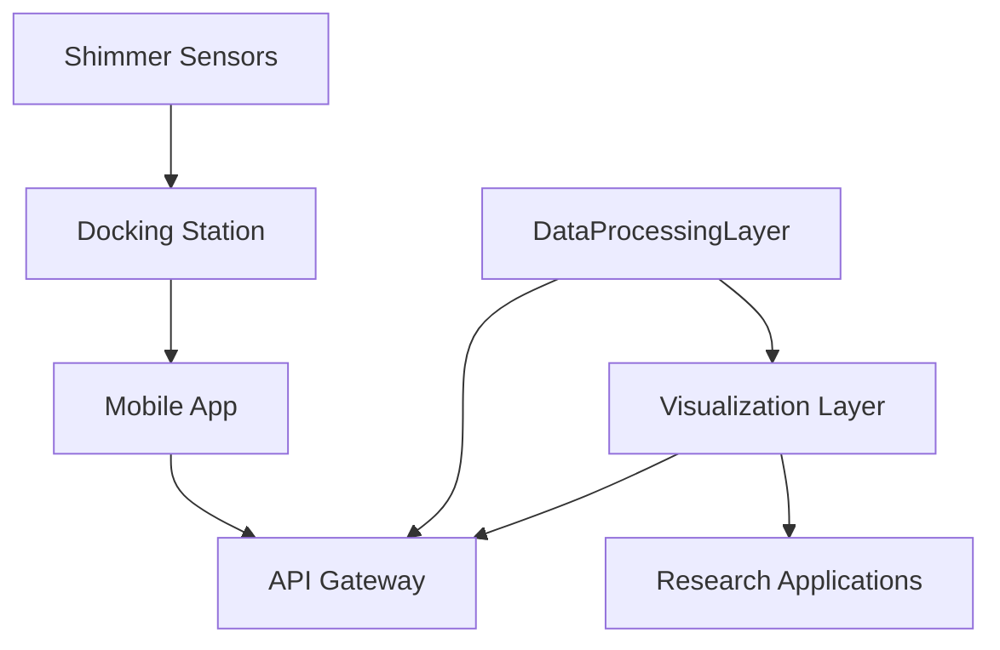
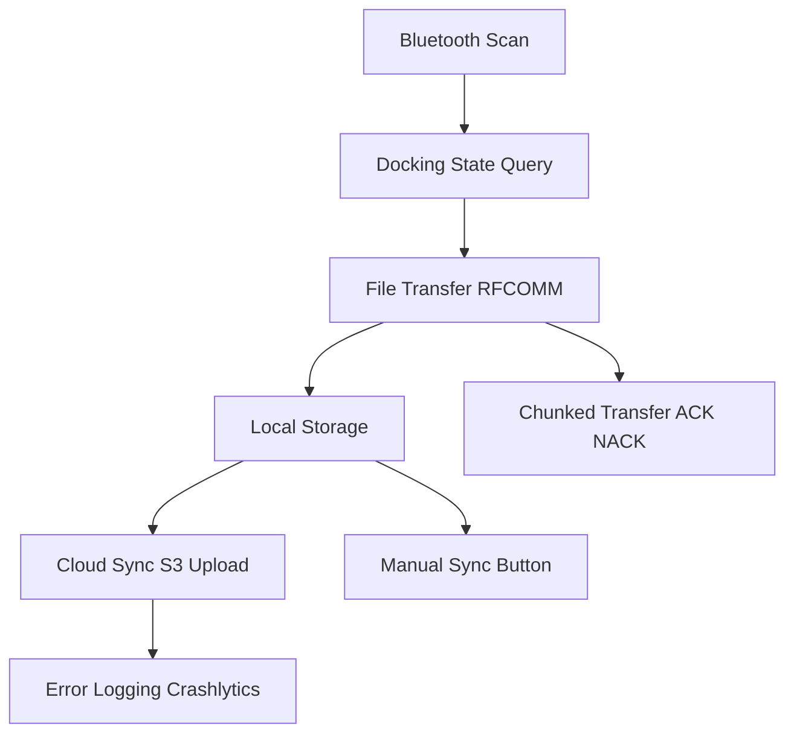
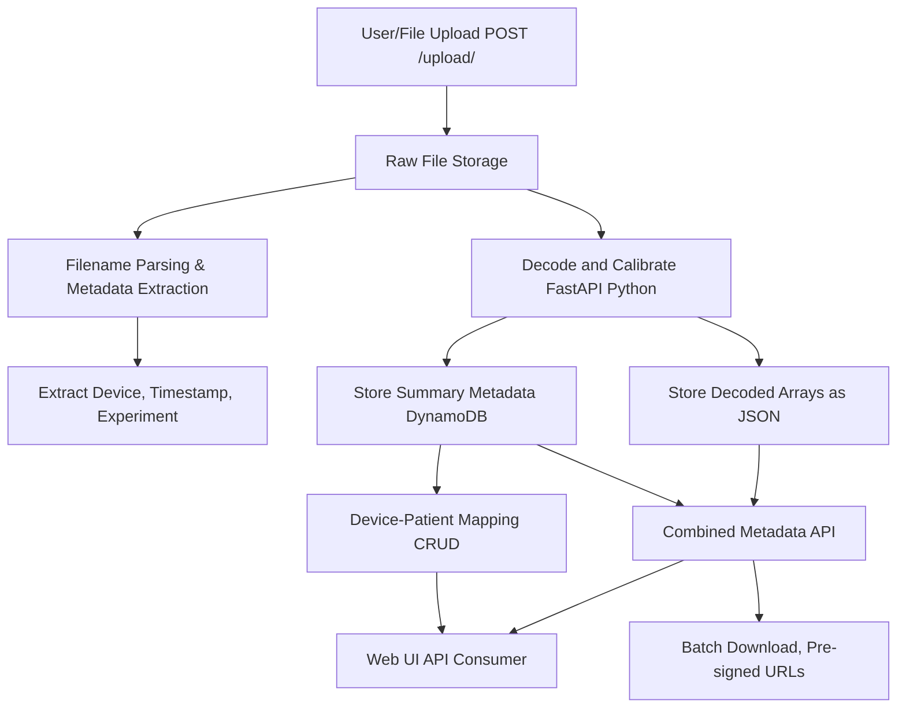
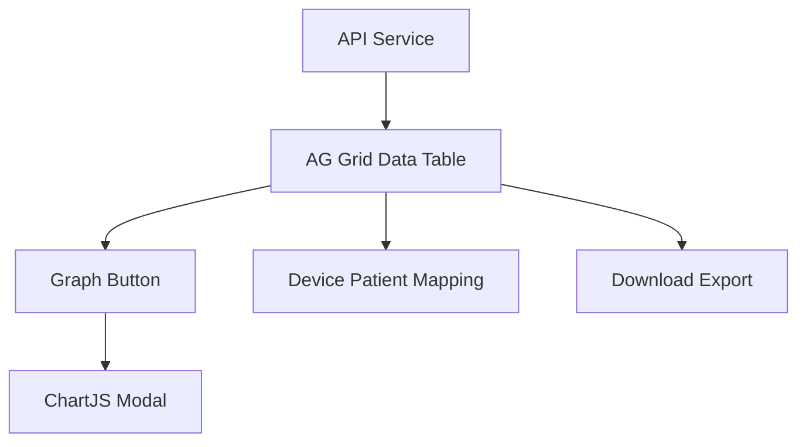
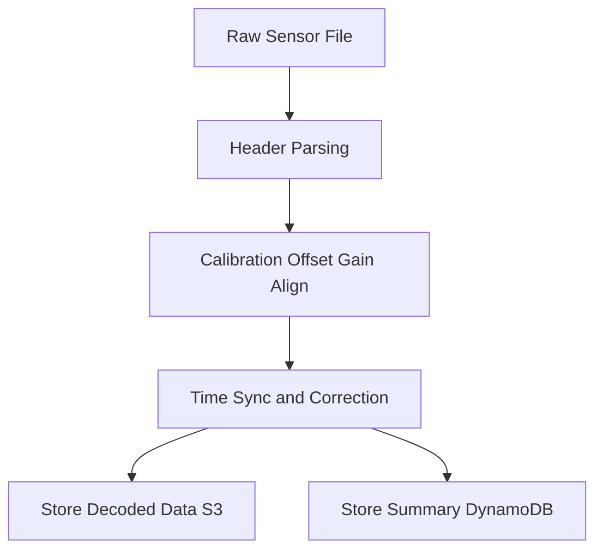

---
tags:
  - architecture
  - system-design
  - shimmer-sensor
  - subsystems
---

# System Architecture

This document outlines the architecture of the UMass Shimmer sensor platform, including hardware components, software layers, and data flow.

## Overview


The UMass Shimmer system follows a modular architecture designed for flexibility, scalability, and ease of integration with existing research workflows.



## Hardware Architecture

<!-- TODO: Zhaolong -->

## Software Architecture

### Application Layers

#### 1. Device Layer
- **Firmware**: Embedded software on Shimmer devices
- **Drivers**: Hardware abstraction and control
- **Protocols**: Communication and data transfer standards

#### 2. Middleware Layer
- **Connection Management**: Device discovery and pairing
- **Data Synchronization**: Real-time and batch data handling
- **Protocol Translation**: Format conversion and standardization

#### 3. Application Layer
- **Research Tools**: Data analysis and visualization
- **Mobile Apps**: Real-time monitoring and control
- **Web Interface**: Dashboard and configuration management

#### 4. Integration Layer
- **APIs**: RESTful and WebSocket interfaces
- **SDKs**: Python
- **Plugins**: Integration with existing research platforms

## Data Flow

### Real-time Streaming

1. **Sensor Activation**: Configured sensors begin data collection
2. **Wireless Transmission**: Bluetooth streaming to receiving device
3. **Data Reception**: Host application receives and validates data
4. **Processing Pipeline**: Real-time analysis and visualization

### Batch Processing

1. **Data Logging**: Sensors store data locally during collection
2. **Docking Transfer**: High-speed download via docking station
3. **Data Validation**: Integrity checking and error correction
4. **Analysis Pipeline**: Offline processing and analysis
5. **Result Generation**: Reports, visualizations, and exports

## Scalability Considerations in Future

### Horizontal Scaling
- **Multi-device Support**: Simultaneous operation of multiple sensors
- **Distributed Processing**: Load balancing across processing nodes
- **Cloud Integration**: Scalable cloud-based analysis infrastructure

### Vertical Scaling
- **Performance Optimization**: Efficient algorithms and data structures
- **Resource Management**: Dynamic allocation of computing resources
- **Caching Strategy**: Intelligent data caching for improved performance

---

# Subsystem Details

### 1. Android Subsystem: Docking & Data Sync App

**Purpose:**
Automates nightly docking, data transfer, and cloud sync for Shimmer sensors. Designed for robust, unattended operation on Android devices.

**Architecture Diagram:**


**Key Features:**

- Scans for up to two Shimmer devices via Bluetooth, adds to processing queue.
- Monitors docking state, queries device for RTC timestamp.
- Transfers files using chunked RFCOMM protocol with ACK/NACK and retries.
- Stamps file headers with device and system timestamps for traceability.
- Queues files for cloud sync; uploads to S3-compatible endpoint when network is available.
- Logs all operations and errors via Firebase Crashlytics.
- Manual sync and mapping controls available in UI.

**Protocol Details:**

- **Dock Query:** App sends 0xD5 (CHECK_DOCK_STATE), receives 0xD6 (RESPONSE_DOCK_STATE), status byte, and 8-byte RTC64 timestamp (little-endian, decoded as `seconds = rtc64 / 32768.0`).
- **File Transfer:**
    - Initiate RFCOMM connection.
    - Request file list, transfer each file in numbered chunks.
    - Each chunk: chunk number, data, checksum. Waits for ACK/NACK.
    - Retries on error, logs all failures.
    - After transfer, files are queued for sync and uploaded to S3.
- **Sync Logic:**
    - Checks network, uploads unsynced files to S3 endpoint.
    - Marks files as synced on success, retains on failure for retry.

**Codebase Highlights:**

- `DockingManager`: Orchestrates protocol, manages retries, timestamps.
- `ShimmerFileTransferClient`: Handles RFCOMM, chunked transfer, header stamping.
- `DockingService`, `ScanningService`, `TransferService`, `SyncService`: Foreground/background services for long-running ops and notifications.
- `Broadcast Receivers`: For system/app events (boot, triggers).
- `DockingTimestampModel`: Encapsulates RTC values per device/session.


### 2. Cloud Sync Backend (FastAPI, S3, DynamoDB)

**Architecture & Data Flow:**


**Detailed Steps:**

1. **File Upload:** User or device uploads raw sensor file via REST API (`POST /upload/`).
2. **Raw Storage:** File is stored in an S3 bucket. Filenames are parsed to extract device ID, timestamp, and experiment metadata.
3. **Decoding & Calibration:** FastAPI backend (Python, ported from MATLAB) decodes binary data, applies calibration (offset, gain, alignment), and computes derived metrics.
4. **Data Storage:**
    - Full decoded arrays are stored as JSON in S3 for later retrieval and analysis.
    - Summary metadata (device, patient, time window, experiment) is stored in DynamoDB for fast queries.
5. **Grouping:** Records are grouped by device and patient, then split into groups where all records are within a tunable time window (default: 15s). Each group is assigned a unique `group_id` based on the earliest timestamp.
6. **Device-Patient Mapping:** CRUD operations for device-patient mapping are handled via DynamoDB, supporting flexible assignment and lookup.
7. **API Endpoints:**
    - `POST /upload/`: Upload file
    - `GET /files/metadata/`: List files grouped by device/date/patient
    - `GET /files/combined-meta/`: Combined metadata with decoded data
    - `POST /decode-and-store/`: Decode file, store summary in DDB, full in S3
    - `GET /download/{filename}`: Download file
    - `GET /devices/unregistered`: List devices in S3 but not mapped
    - `GET /patients`: List unique patients
    - ...and more (see Cloud Sync README)
8. **Batch & Pre-signed Downloads:** The backend provides batch download endpoints and pre-signed URLs for secure, time-limited access to files.
9. **Web UI Integration:** The Web UI consumes the combined metadata API, supports device-patient mapping, and enables download/export features.


### 3. Web UI (Shimmer_Server_UI)

**Graph:**



**Purpose:** Angular-based dashboard for visualization, management, and download of Shimmer sensor data.

**Key Features:**

- Query metadata and filter files by user, device, or session.
- Fetch and download decoded JSON files directly from S3.
- Supports **downsampling** for large datasets (6 k+ points) for improved chart readability.
- Built with **Angular** for modular, component-based development.
- Authentication and authorization powered by **AWS Amplify User Pools**.

**Architecture:**

- `src/app/comp/data-grid/`: AG Grid component for data display, graph buttons for Shimmer.
- `src/app/pages/home-page/`: Dashboard with device/user stats, charts, and mapping UI.
- `src/app/services/api.service.ts`: Handles API integration for S3 data, metadata, and decoded files.

**Data Flow:**

1. API fetches combined metadata from backend.
2. Data displayed in AG Grid with Shimmer 1/2 columns.
3. Graph button emits time-series data to parent component.
4. Modal opens with Chart.js rendering time vs acceleration.

**Planned Extensions:**

- Analytical dashboards for multi-sensor studies.
- Integration with external research tools and ML pipelines.


### 4. Data Processing & Calibration Pipeline

**Graph:**


**Read:**
```text
1. Upload file to backend (S3).
2. Backend decodes and calibrates data.
3. Store full decoded arrays in S3, summary in DynamoDB.
4. Web UI fetches and visualizes processed data.
```

**Decoding Process:**

- Binary sensor data decoding (Shimmer3 format)
  - 256-byte header: device info, sample rate, enabled sensors, calibration parameters
  - Variable-length data packets (3-byte timestamp + sensor channels)
- Multi-channel support with raw and calibrated data:
  - Accel_LN (Low-Noise Accelerometer): X, Y, Z axes
  - Accel_WR (Wide-Range Accelerometer): X, Y, Z axes
  - Gyro (Gyroscope): X, Y, Z axes
  - Mag (Magnetometer): X, Y, Z axes
  - Each channel provides both raw and calibrated (_cal) values

**Calibration Details:**

- Inertial sensor calibration (offset, gain, alignment) for all axes and sensor types.
- Time synchronization with phone RTC and rollover correction
  - Initial RTC sync from phone timestamp (Unix epoch)
  - Output: Unix timestamps in `timestampCal`, ISO 8601 in `timestampReadable`

**Computed Metrics:**

- `Accel_WR_Absolute`: Magnitude (√(x² + y² + z²)) for each sample
- `Accel_WR_VAR`: Range (max - min) of absolute acceleration
- UWB distance (`uwbDis`): Ultra-wideband distance readings (float, meters or device units)

**Flexible Time-Based Grouping:**

- Decoded records are grouped by device and patient, then split into groups where all records are within a tunable time window (default: 15 seconds) of each other, regardless of date boundaries.
- Each group is assigned a unique `group_id` based on the earliest timestamp in the group.
- Shimmer assignment within group is based on device mapping from DynamoDB.

**Calibration and Decoding Script:**

- `shimmerCalibrate.py`: Direct Python port of MATLAB function with robust handling for binary decoding, dynamic channel parsing, custom 24-bit signed integer support, inertial sensor calibration, time calibration with rollover correction and smoothing.
- Outputs both Unix and ISO 8601 timestamps.
- All array math implemented using standard Python (no NumPy required).
- Optional plotting and MATLAB file export if dependencies are available.
---


### 5. Hardware Subsystem
<!-- TODO: Zhaolong -->

# Technology Summary

| Layer          | Technology                            | Purpose                                  |
| -------------- | ------------------------------------- | ---------------------------------------- |
| **Hardware**   | Shimmer 3 Wireless Sensors            | Physiological and kinematic data capture |
| **Mobile App** | Android (Java)                        | Docking, transfer, and sync automation   |
| **Backend**    | AWS Lambda + FastAPI (Python)         | Serverless decoding and APIs             |
| **Storage**    | Amazon S3 + DynamoDB                  | Hybrid data + metadata storage           |
| **Web UI**     | Angular + Amplify Auth                | Visualization and management             |
| **Monitoring** | AWS CloudWatch + Firebase Crashlytics | Centralized logs and diagnostics         |

