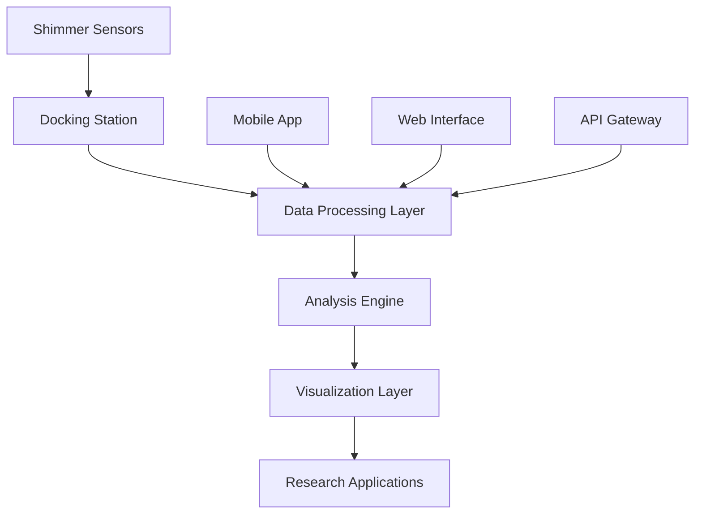
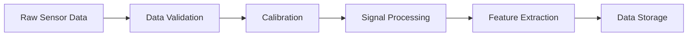

# System Architecture

This document outlines the architecture of the UMass Shimmer sensor platform, including hardware components, software layers, and data flow.

## Overview

The UMass Shimmer system follows a modular architecture designed for flexibility, scalability, and ease of integration with existing research workflows.

## Hardware Architecture

### Shimmer Sensor Nodes

**Core Components:**
- **MCU**: Low-power microcontroller for sensor management
- **Radio**: Bluetooth Low Energy for wireless communication  
- **Sensors**: Configurable sensor array (accelerometer, gyroscope, magnetometer, etc.)
- **Storage**: Local data buffering and logging capability
- **Power**: Rechargeable battery with power management

### Docking Platform

**Physical Interface:**
- Multi-sensor charging and data transfer
- USB and Ethernet connectivity
- LED status indicators
- Compact desktop form factor

**Functionality:**
- Simultaneous charging of multiple sensors
- High-speed data download
- Firmware updates
- Configuration management

## Software Architecture

### Data Processing Pipeline

### Application Layers

#### 1. Device Layer
- **Firmware**: Embedded software on Shimmer devices
- **Drivers**: Hardware abstraction and control
- **Protocols**: Communication and data transfer standards

#### 2. Middleware Layer
- **Connection Management**: Device discovery and pairing
- **Data Synchronization**: Real-time and batch data handling
- **Protocol Translation**: Format conversion and standardization

#### 3. Application Layer
- **Research Tools**: Data analysis and visualization
- **Mobile Apps**: Real-time monitoring and control
- **Web Interface**: Dashboard and configuration management

#### 4. Integration Layer
- **APIs**: RESTful and WebSocket interfaces
- **SDKs**: Python, MATLAB, and other language bindings
- **Plugins**: Integration with existing research platforms

## Data Flow

### Real-time Streaming

1. **Sensor Activation**: Configured sensors begin data collection
2. **Local Processing**: Basic filtering and compression on-device
3. **Wireless Transmission**: Bluetooth streaming to receiving device
4. **Data Reception**: Host application receives and validates data
5. **Processing Pipeline**: Real-time analysis and visualization

### Batch Processing

1. **Data Logging**: Sensors store data locally during collection
2. **Docking Transfer**: High-speed download via docking station
3. **Data Validation**: Integrity checking and error correction
4. **Analysis Pipeline**: Offline processing and analysis
5. **Result Generation**: Reports, visualizations, and exports

## Security Architecture

### Device Security
- **Encryption**: AES-256 for data transmission
- **Authentication**: Device pairing and access controls
- **Firmware Verification**: Signed firmware updates

### Data Security
- **Privacy**: Personal data protection and anonymization
- **Storage**: Encrypted local and cloud storage options
- **Access Control**: Role-based permissions and audit logging

## Scalability Considerations

### Horizontal Scaling
- **Multi-device Support**: Simultaneous operation of multiple sensors
- **Distributed Processing**: Load balancing across processing nodes
- **Cloud Integration**: Scalable cloud-based analysis infrastructure

### Vertical Scaling
- **Performance Optimization**: Efficient algorithms and data structures
- **Resource Management**: Dynamic allocation of computing resources
- **Caching Strategy**: Intelligent data caching for improved performance

## Integration Points

### Research Platforms
- **MATLAB**: Native toolbox integration
- **Python**: Comprehensive SDK and libraries
- **R**: Statistical analysis packages
- **LabVIEW**: Hardware interface modules

### External Systems
- **EMR Integration**: Healthcare record systems
- **LIMS**: Laboratory information management
- **Cloud Platforms**: AWS, Azure, Google Cloud integration
- **Analytics Tools**: Tableau, PowerBI, Jupyter notebooks

## Performance Metrics

### Latency
- **Streaming**: <100ms end-to-end latency
- **Processing**: Real-time analysis capabilities
- **Response**: <1s user interface responsiveness

### Throughput
- **Data Rate**: Up to 1MB/s per sensor
- **Concurrent Users**: 100+ simultaneous connections
- **Batch Processing**: 1GB+ datasets in minutes

### Reliability
- **Uptime**: 99.9% system availability
- **Data Integrity**: <0.001% data loss rate
- **Error Recovery**: Automatic retry and failover mechanisms