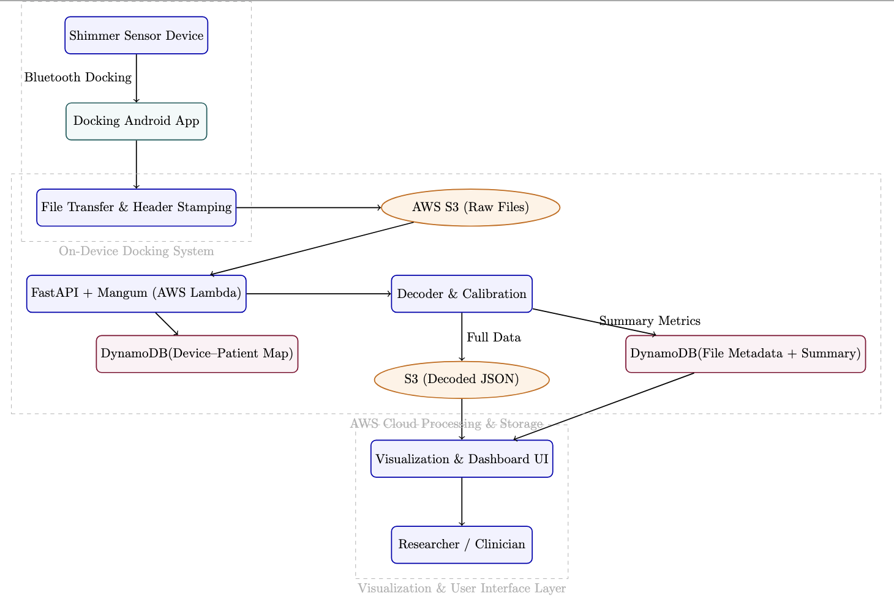

# UMass Shimmer Project

Welcome to the UMass Shimmer Project documentation. This project focuses on developing and implementing sensor technology using Shimmer wireless sensor platforms for research and development at the University of Massachusetts.

## What is Shimmer?
<!-- TODO: Zhaolong -->

Shimmer is a wireless sensor designed for real-time human motion analysis, environmental monitoring, and physiological measurements. 

## Hardware Components Overview

The platform is designed to work with any data-collecting sensor device.  
In our deployment, we use **Shimmer sensors** as an example, but the system can be adapted to other wearable or IoT sensors that collect physiological or environmental data.

<!-- TODO: Zhaolong -->

## Software Components Overview

Our platform consists of several core software components, each with specific roles and technical responsibilities.

### Cloud Backend
- Provides a central API for uploading, downloading, and managing sensor data and metadata.  
- Receives files from the mobile app, processes and calibrates the data, and stores both raw and processed results.  
- Manages secure access to file storage and metadata for other components.  
- Groups and organizes files by device, user, and time for easy retrieval and analysis.  
- Serves as the main integration point for the web dashboard and mobile app.  
*Rationale: Serverless architecture enables automatic scaling and cost efficiency.*

---

### Mobile App
- Collects data from wearable sensors and manages local storage of files.  
- Detects when sensors are ready to transfer data and initiates file transfer.  
- Ensures reliable transfer of files to the backend, with error handling and retries.  
- Tracks which files have been uploaded and manages uploads when a network is available.  
- Tags each file with device and time information for traceability.  
*Rationale: Local-first design ensures data collection works offline and syncs when connected.*

---

### Web Dashboard
- Provides a user interface for browsing, searching, and visualizing sensor data.  
- Allows users to download files, manage devices, and map devices to users or patients.  
- Supports secure login and access control for different user roles.  
- Enables bulk operations and administrative management of the system.  
*Rationale: Web-based interface provides universal access without app installation.*

---

### Database
- Stores metadata about files, devices, users, and summary statistics for fast lookup and queries.  
- Supports grouping, searching, and validation of data sync status.  
- Keeps only summary and reference data, with large files stored separately.  
*Rationale: NoSQL database optimized for flexible queries and high performance.*

---

### File Storage
- Stores all raw and processed sensor data files.  
- Supports scalable upload and download of large datasets.  
- Provides secure, time-limited access to files for authorized users and components.  
- References to files are stored in the database for quick lookup.  
*Rationale: Object storage provides unlimited scalability and cost-effective archiving.*

---

## Workflow Summary

1. The **mobile app** collects data from Shimmer sensors, transfers files, and uploads them to the **cloud backend**.  
2. The **backend** decodes, calibrates, and stores data in **Amazon S3** and **DynamoDB**.  
3. The **web dashboard** provides researchers with tools to browse, visualize, and download data, as well as manage devices and users.  
4. **DynamoDB** and **S3** work together to provide fast metadata queries and scalable file storage.

## Quick Start

Ready to get started? Check out our [Getting Started](getting-started.md) guide for setup instructions and basic usage.

## Project Components

- **Shimmer Sensors**: Wireless sensor nodes for data collection
- **Docking Platform**: Hardware interface for sensor management
- **Data Processing**: Software tools for analysis and visualization
- **Protocol Implementation**: Communication standards and APIs

## Documentation Structure

- **[Getting Started](getting-started.md)**: Setup and installation guide
- **[Architecture](architecture.md)**: System design and components  
- **[Hardware & Firmware](hardware-firmware.md)**: Shimmer sensor hardware and firmware details
- **[Protocol](protocol.md)**: Communication protocols and APIs
- **[Experiments](experiments.md)**: Experimental validation and results
- **[Shimmer Server UI](shimmer-server-ui.md)**: Web dashboard for data visualization and management
- **[Mobile App](myapplication.md)**: Android app for docking and data sync
- **[Cloud Sync](cloud-sync.md)**: Backend API for data processing and storage

## Developers & Professor Guide

  
  <table align="center" width="80%">
    <tr>
      <td align="center" valign="top" width="50%">
        <b>Principal Investigators</b>  
        <a href="https://www.cics.umass.edu/about/directory/ivan-lee"><b>Prof. Ivan Lee</b></a> 
        CICS, UMass Amherst
          
        <a href="https://www.umass.edu/engineering/about/directory/jeremy-gummeson"><b>Prof. Jeremy Gummeson</b></a> 
        Engineering, UMass Amherst
      </td>
      <td align="center" valign="top" width="50%">
        <b>Developers</b>  
        🧑‍💻 Zhaolong  

  <a href="https://github.com/swetha4444"><b>Swetha Saseendran</b></a> 
  <a href="mailto:ssaseendran@umass.edu" style="font-size:0.95em; color:#555;">ssaseendran@umass.edu</a> 
  CICS, UMass Amherst
      </td>
    </tr>
  </table>

## Community & Support

This project is developed and maintained by the University of Massachusetts research community. For questions, issues, or contributions, please visit our [GitHub repository](https://github.com/shimmerumass/shimmerumass-webpage).

---

!!! info "Project Status"
    This project is actively under development. Documentation and features are continuously being updated.