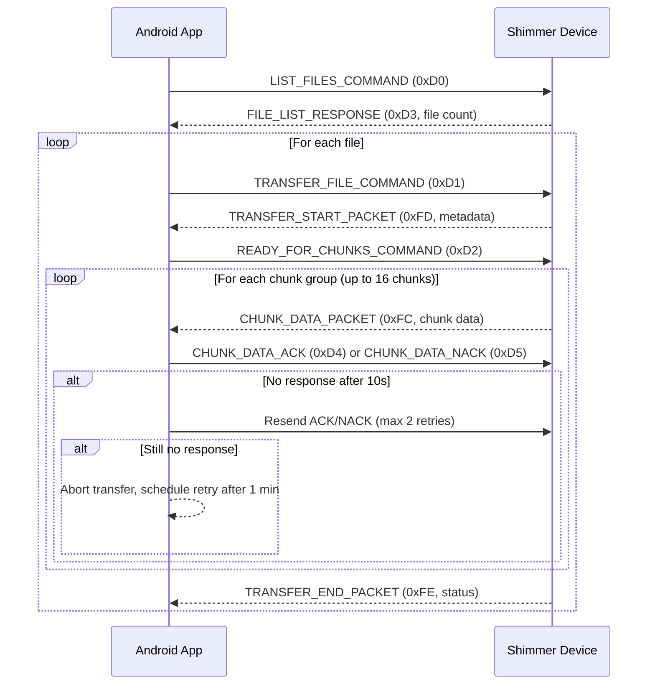

# Communication Protocol

<!-- TODO: Zhaolong -->

This document describes the communication protocols used by the UMass Shimmer sensor platform for device control, data transmission, and system integration.

## Android Docking & File Transfer Protocol

The Android app implements a robust, chunked file transfer protocol over Bluetooth RFCOMM for reliable data offload from Shimmer sensors during docking. This protocol is designed for resilience, traceability, and error recovery.

### Docking Workflow

1. **Device Discovery & Monitoring**
  - The app scans for up to two paired Shimmer devices via Bluetooth RFCOMM.
  - Each device is monitored for docking state (physical connection and readiness for transfer).
  - The app manages session state, retry logic, and transitions between scanning, monitoring, and transfer.

2. **Dock Query**
  - When a device is docked, the app queries the device for its real-time clock (RTC) value.
  - This timestamp is later stamped into the file header for traceability.

### File Transfer Protocol (Bluetooth RFCOMM)

#### 1. Connection Establishment
  - The app creates an RFCOMM socket to the Shimmer device using a standard UUID.
  - Up to 3 connection attempts are made with 1-second intervals.

#### 2. File List Request
  - The app sends a `LIST_FILES_COMMAND` (0xD0).
  - The device responds with `FILE_LIST_RESPONSE` (0xD3) and the number of files available.

#### 3. File Transfer Loop
  - For each file:
    - The app sends `TRANSFER_FILE_COMMAND` (0xD1).
    - The device responds with `TRANSFER_START_PACKET` (0xFD), including protocol version, filename, tags, file size, chunk size, and total chunks.
    - The app constructs a new filename for local storage, including device and experiment tags.

#### 4. Chunked Data Transfer
  - The app sends `READY_FOR_CHUNKS_COMMAND` (0xD2) to signal readiness.
  - The device sends file data in groups of up to 16 chunks, each as a `CHUNK_DATA_PACKET` (0xFC):
    - Each chunk includes a chunk number, size, and data.
    - The app writes each chunk to the output file and logs hex data for debugging.
  - After each group, the app sends an ACK (`CHUNK_DATA_ACK`, 0xD4) or NACK (`CHUNK_DATA_NACK`, 0xD5) with the first chunk number and status.
  - If no response is received after 2 ACK retries, the transfer is aborted and scheduled for retry.

#### 5. Transfer Completion
  - After all chunks are received, the device sends a `TRANSFER_END_PACKET` (0xFE) with a status byte (0x01 for success, 0x00 for failure).
  - The app marks the transfer as successful or failed, updates the local database, and logs analytics.

#### 6. Error Handling & Recovery
  - Unexpected headers, timeouts, or invalid chunks trigger retries or silent backoff.
  - Incomplete files are deleted, and database entries are cleaned up.
  - All errors are logged to Firebase Crashlytics for diagnostics.

#### File Header Stamping
  - During transfer, the app stamps each file header with:
    - Shimmer device RTC64 (from dock query)
    - Android system RTC32 (system time)
  - This ensures traceability and supports data integrity checks.

The protocol is designed for reliability, with chunked transfer, ACK/NACK, retries, and error recovery. All operations are logged for monitoring and troubleshooting, ensuring accurate data transfer even in the presence of Bluetooth errors or interruptions.

The Shimmer platform implements a layered protocol stack supporting multiple communication methods:

- **Bluetooth Low Energy (BLE)** for wireless sensor communication
- **USB/Serial** for high-speed docking station interface
- **HTTP/WebSocket** for web-based applications
- **TCP/UDP** for network-based integrations

### Sensor Data Layout
```
Accelerometer: 6 bytes (X, Y, Z as signed 16-bit)
Gyroscope:     6 bytes (X, Y, Z as signed 16-bit)  
Magnetometer:  6 bytes (X, Y, Z as signed 16-bit)
Temperature:   2 bytes (signed 16-bit, 0.1°C resolution)
Pressure:      3 bytes (unsigned 24-bit, Pa)
```


### RESTful API Endpoints

#### Device Management
```http
GET    /api/devices              # List all devices
GET    /api/devices/{id}         # Get device details  
POST   /api/devices/{id}/connect # Connect to device
DELETE /api/devices/{id}/connect # Disconnect device
```

#### Configuration
```http
GET    /api/devices/{id}/config      # Get configuration
PUT    /api/devices/{id}/config      # Update configuration
POST   /api/devices/{id}/calibrate   # Start calibration
GET    /api/devices/{id}/status      # Get device status
```

#### Data Access
```http
GET    /api/devices/{id}/data/live   # Real-time data stream
GET    /api/devices/{id}/data/batch  # Historical data
POST   /api/devices/{id}/data/export # Export data formats
```
## Android Docking & File Transfer Protocol Sequence Diagram

